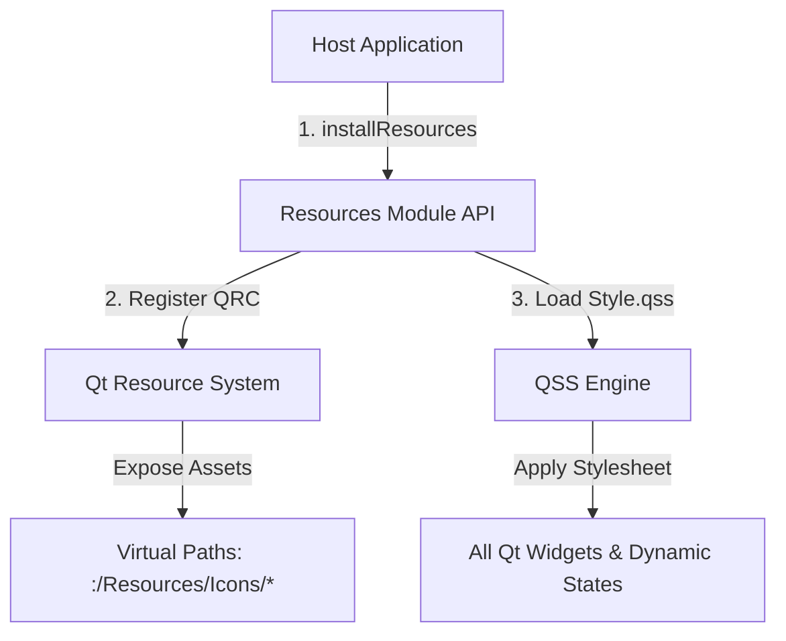

# 🎨 Resources Module

[](https://en.cppreference.com/w/cpp/compiler_support)
[](https://www.qt.io/)
[](#)
[](#)

Playground 애플리케이션의 시각적 일관성을 확보하고, 라이트 테마 QSS, 공용 아이콘, 로고 에셋들을 효율적으로 배포하고 전역 관리하기 위한 Qt 리소스 전용 공통 모듈입니다.

---

## 🚀 Key Features

* **전역 일관성 테마 (QSS)**: 모던하고 플랫한 감각의 프리미엄 라이트 테마 스타일시트(`Style.qss`)를 내장하여 일률적인 UI 감성을 보장합니다.
* **단일화된 에셋 파이프라인**: 모든 애플리케이션 아이콘 및 브랜드 로고 자원이 `:/Resources` 가상 QRC 경로로 컴파일되어 파일 시스템 결합 없이 임베디드 배포됩니다.
* **원클릭 스타일 설치 API**: `Resources::installResources(app)` 호출을 통해 별도의 리소스 번들 로딩 코드 작성 없이 QSS 적용, 번들 리소스 등록, 앱 아이콘 지정을 한 번에 수행할 수 있습니다.
* **State visualization style contract**: Camera and Gocator status indicators share one dynamic CSS property (`status`) and color map for `Idle`, `Disconnected`, `Connected`, and `Live` states.
* **Neutral source-control styling**: `QStaticImageControlWidget` tool buttons, FPS input, and list selection use compact neutral styling aligned with the Camera/Gocator control-panel tone.

---

## 📦 Asset Architecture

Resources 모듈이 호스트 프로그램에 바인딩되고 스타일시트가 주입되는 아키텍처 흐름입니다.



---

## 🛠️ Requirements & Dependencies

| Requirement | Description |
| :--- | :--- |
| **OS Support** | Qt6를 지원하는 모든 OS 공통 (macOS / Windows / Linux) |
| **C++ Standard** | C++17 이상 필수 |
| **Qt SDK** | Qt 6.4 이상 개발 환경 권장 (CMake 3.16+ 필요) |

---

## 💻 Quick Start

### 1. CMake Integration
상위 프로젝트 CMakeLists.txt에 서브프로젝트로 연동하여 링크합니다.

```cmake
# Add module target
add_subdirectory(modules/Resources)

# Link to host target
target_link_libraries(YourHostApp PRIVATE Resources::Resources)
```

### 2. Basic Example
```cpp
#include "Resources.h"
#include <QApplication>
#include <QMainWindow>

int main(int argc, char* argv[])
{
    QApplication app(argc, argv);

    // 공용 리소스 등록 및 테마 스타일시트(QSS) 전역 적용
    Resources::installResources(app);

    QMainWindow mainWindow;
    mainWindow.show();

    return app.exec();
}
```

---

## ⚠️ Development Notes

> [!IMPORTANT]
> **모듈 단일 책임 원칙 (SRP)**
> 이 모듈은 오직 시각적 리소스(QSS, 아이콘 이미지, 로고, 리소스 로드 헬퍼)의 보관과 적용만을 전담해야 합니다. 센서 구동 백엔드 로직이나 시각화 렌더링, 특정 메인 윈도우 UI 로직은 절대 여기에 포함하지 말아야 합니다.

> [!WARNING]
> **가상 경로 사용 필수**
> 아이콘이나 스타일 파일 참조 시 로컬 파일 시스템 경로(예: `C:/Project/style.qss`) 대신 항상 Qt 리소스 시스템에 컴파일된 가상 경로인 `:/Resources/Icons/[아이콘이름].png` 또는 `:/Resources/Style.qss` 형식을 사용해야 크로스 플랫폼 호환성이 깨지지 않습니다.

> [!TIP]
> **Dynamic QSS Properties**
> 특정 위젯에 상태별 dynamic styling(예: 커넥션 정상 녹색 점멸, 에러 적색 점멸)을 적용할 때, 코드 내에 CSS 색상값을 하드코딩하지 마십시오. 대신 `widget->setProperty("status", "live")`와 같이 QSS dynamic property를 지정하고 `style()->unpolish()`/`polish()`를 실행해 QSS에 미리 선언된 스타일로 렌더링되게 설계하는 것을 강력히 권장합니다.

> [!TIP]
> **Test image controls**
> Keep `QStaticImageControlWidget` sizing and selection tone in `Style.qss`: its playback buttons and FPS field align with device controls, and selected files use neutral gray emphasis rather than a device-specific accent color.
